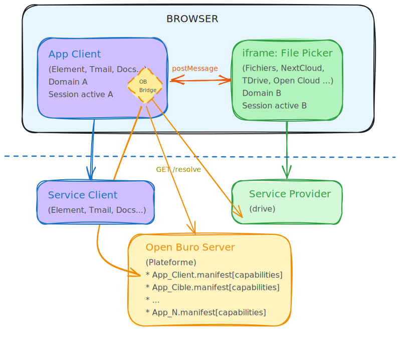

# Frontend Approach

[← Comparison Table](../state-of-the-art/comparison.md) · [Home](../index.md)

---

## Architecture — Principle

*[Open in Excalidraw](https://excalidraw.com/#json=){:target="_blank"} — [Editable source](architecture-cible.excalidraw)*

## Principles

* **Client**: the calling application — uses an `ob_bridge` library that exposes an API to invoke the File Picker and receive the result via a callback.
* **ob_bridge**: Open Buro Bridge — library responsible for:
  * knowing the capabilities available on the platform
  * resolving an intent into a capability (resolver + chooser)
  * driving the lifecycle of the capability iframe (sizing, bidirectional message handling, etc.)
* **service**: the target application — exposes its capabilities through its manifest
* **domains and sessions**: client and target applications live on distinct domains with their own sessions (possibly via a shared SSO).
  * This way services are fully isolated from each other and there are no authorization concerns
* **Discovery**:
  * The list of capabilities is provided by a basic server ("Open Buro Server"), with no authentication, exposing the capabilities of the platform's applications.
  * **Ultra-minimalist alternative:** a simple environment variable like `drive.example.com/pick` — functional but static; since a platform service will be needed anyway, leveraging it makes more sense — to be discussed.
* **binary**: if the calling app needs the binary content, it is up to it to fetch the URLs returned, rather than routing binaries through the iframe (prerequisite: the service must be able to produce a secure download URL).

## Motivations

1. **Zero Trust**: apps live on distinct domains and stay isolated, both server-side and in the browser.
   1. **Authentication** — The user already has open web sessions on all three services (calling app, source/drive, platform), each on its own domain. No SSO, no token exchange. For the hackathon, it is possible to bypass the browser's security boundaries (CSP, same-origin) via browser extensions.
   2. **Permissions** — No direct interaction between the calling app and the source. If the File Picker returns a link rather than a file, the URL embeds the token according to the drive's own strategy — there is no need to normalize access, only the HTTP response.
2. **Integrated UX**: the FP opens directly inside the calling app, no new window.
3. **A FP fully tailored to its back-end**: the FP front-end is provided by the drive and can therefore make full use of all the drive's features (folder colors, per-folder icons, file status and metadata handling, favorites…).
4. **Loose coupling**: the calling app knows nothing about the FP or the target application.
5. **Small footprint in the calling app**: just adding a library, calling an API with a callback.
6. **Auto-discovery & genericity**: thanks to capability exposure through app manifests centralized by the "platform".
7. **OpenBuro Server is optional** and can be replaced by hard-coded configuration in the calling app.

**Frontend architectures** — Two compatible scenarios will coexist. Each editor chooses, while still complying with the File Picker protocol:

| Scenario       | Description                                                                                 | Advantage                                  |
| -------------- | ------------------------------------------------------------------------------------------- | ------------------------------------------ |
| **1 — Direct** | The calling app opens the capability iframe itself and communicates via postMessage         | Simple, self-contained                     |
| **2 — Shell**  | The client service talks to its "shell" app, which opens the capability iframe             | Consistent with the current Twake approach |

---

## Technical Specifications

- [File Picker Intent Semantics (DRAFT ALPHA)](file-picker-semantics.md)
- [Detailed postMessage Protocol (DRAFT ALPHA)](postmessage-protocol.md)
- [Browser workarounds for the hackathon](browser-workarounds.md)
- [Workshop discussion topics](workshop-topics.md)
