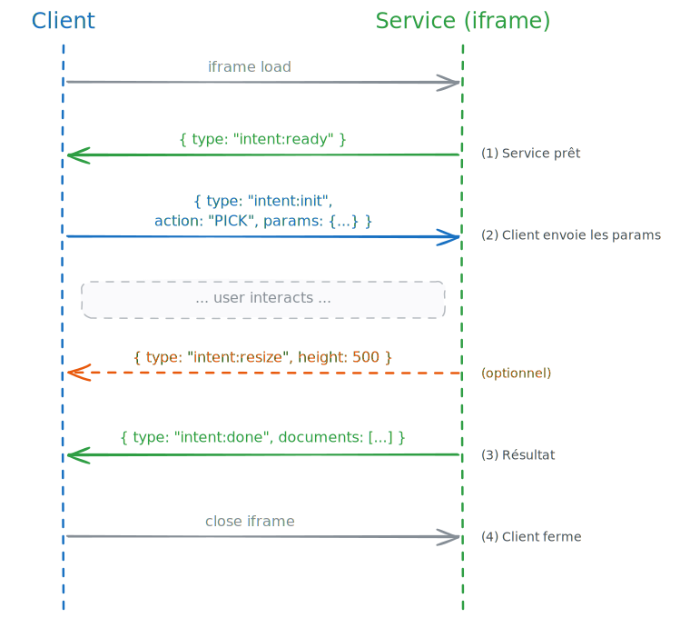

# Detailed postMessage Protocol (DRAFT ALPHA)

[← File Picker Semantics](file-picker-semantics.md) · [Frontend Approach](index.md) · [Home](../index.md)

---

*[Editable source](../../fr/proposition-hackathon/protocole-postmessage.excalidraw)*

**postMessage security:** Every message must be validated against `event.origin` on the receiver side.

---

[Next: Browser Workarounds →](browser-workarounds.md)
