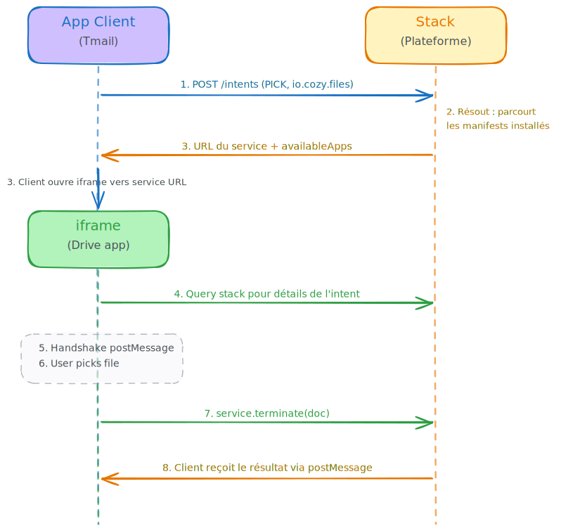

# Cozy Cloud / Twake Workplace

[← Freedesktop.org](freedesktop.md) · [State of the Art](index.md) · [Home](../index.md)

---

Cozy implements an intent system directly inspired by Android, adapted to the web context.

## Declaration in the App Manifest

```json
{
  "intents": [
    {
      "action": "PICK",
      "type": ["io.cozy.files", "image/*"],
      "href": "/pick"
    },
    {
      "action": "EDIT",
      "type": ["image/png"],
      "href": "/editor"
    }
  ]
}
```

Each declared intent contains:

- **`action`** — verb: `CREATE`, `EDIT`, `OPEN`, `PICK`, `SHARE` (extensible list)
- **`type`** — one or more data types (MIME or Cozy doctypes such as `io.cozy.files`)
- **`href`** — relative route in the app that handles this intent

## Intent Lifecycle



*[Editable source](../../fr/etat-de-lart/cozy-cycle-vie-intent.excalidraw)*

**Detailed steps:**

1. The client calls `cozy.intents.start('PICK', 'io.cozy.files')`
2. The stack walks through the manifests of installed apps, matching action + type
3. The stack returns the service URL (or a list if multiple services match) plus non-installed apps that could handle the intent (`availableApps`)
4. The client opens an **iframe** pointing to the service URL (with `?intent={id}`)
5. Service and client establish a channel via `window.postMessage` (handshake: ready → ack → data)
6. The user interacts with the service (e.g., browses their files, makes a selection)
7. The service calls `service.terminate(document)` — sends a "completed" message with the result
8. The client closes the iframe and uses the result

## Permissions

- The client can request permissions on the returned documents (`GET`, `ALL`)
- The stack only resolves an intent to a service if that service already has the required permissions on the doctype
- Permissions are scoped to the specific documents that are returned

## Cozy / Twake Resources

| Resource                                  | URL                                                                                    |
| ----------------------------------------- | -------------------------------------------------------------------------------------- |
| File Picker intent PR in Twake Drive      | https://github.com/linagora/twake-drive/pull/3787/changes                              |
| Client app template for intents           | https://github.com/cozy/cozy-app-template/blob/master/src/components/Views/Intents.jsx |
| Library for iframe interactions           | https://github.com/linagora/cozy-libs/tree/master/packages/cozy-interapp               |
| Iframe loading components                 | https://github.com/linagora/cozy-libs/tree/master/packages/cozy-ui-plus/src/Intent     |
| cozy-stack intents documentation          | https://docs.cozy.io/en/cozy-stack/intents/                                            |

---

[Next: openDesk →](opendesk.md)
