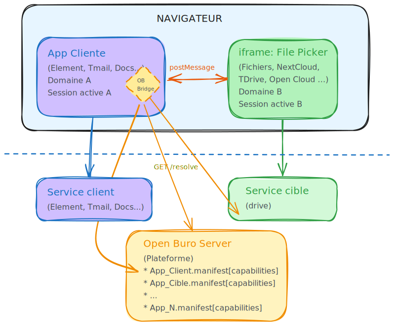

# Approche front

[← Tableau comparatif](../etat-de-lart/comparatif.md) · [Accueil](../index.md)

---

## Architecture - principe

*[Ouvrir dans Excalidraw](https://excalidraw.com/#json=){:target="_blank"} — [Source editable](architecture-cible.excalidraw)*

## Principes

* **Client** : application appelante : dispose d'une librairie "ob_bridge" qui expose une api pour appeler le FP et avoir un call back avec le retour.
* **ob_bridge** : Open Buro Bridge : librairie en charge de :
  * connaitre les capabilities disponibles sur la plateforme
  * résoudre un intent en capabilitie (resolver + chooser)
  * pilotage de l'iframe de la capability sur son cycle de vie (dimensionnement, gestion des messages bi-directionnels...)
* **service** : application cible : expose ses capabilities dans son manifest
* **domaines et sessions** : les applications clientes et cibles sont sur des domaines disctincts, avec leur propres sessions (possiblement via un SSO commun). 
  * De cette façon il y a une étanchéité totale entre les services, aucun sujet d'autautorisation 
* **Discovery** : 
  * la liste des capabilities est fournie par un serveur basique ("open buro server), sans authentification, exposant les capabilities des applications de la plateforme.
  * **Alternative ultra-minimaliste :** une simple variable d'environnement avec `drive.example.com/pick` — fonctionnel mais statique, et comme il y aura besoin d'un service plateforme, autant s'appuyer dessus, à discuter.
* **binaire** : si l'app cliente demande le transfert du contenu binaire : à elle de faire un fetch sur les liens retournés plutot que de faire transiter les binaires par l'iframe (pré requis : le service doit savoir produire une url de téléchargement sécurisé)

## Motivations

1. **Zéro Trust** : les apps sont sur des domaines distincts et restent étanches, tant côté serveur que dans le browser.
   1. **Authentification** — L'utilisateur dispose déjà de sessions web ouvertes sur les trois services (app cliente, source/drive, plateforme), chacun sur son propre domaine. Pas de SSO ni de token exchange. Pour le hackathon, il est possible de contourner les sécurité du navigateur (CSP, same-origin) via des extensions browser.
   2. **Droits** — Pas d'interaction directe entre l'app cliente et la source. Si le File Picker retourne un lien plutôt qu'un fichier, l'URL intègre le token selon la stratégie propre au drive — pas besoin de normaliser l'accès, juste la réponse HTTP.
2. **UX intégrée** : le FP s'ouvre directement dans l'app cliente, pas de nouvelle fenêtre.
3. **un FP totalement adapté à son back** : le front du FP est fourni par le drive et peut donc en exploiter au mieux toutes les fonctionnalités du drive (couleur des dossiers, icônes par dossier, gestion des statuts et métadonnées des fichiers, favoris...)
4. **couplage lache** : l'app cliente ne connait absolument rien ni du FP, ni de l'application cible.
5. **Faible empreinte dans l'app cliente** : ajout d'une librairie, appel à une api avec un call back.
6. **auto discovery & généricité** : grace à l'expositions des capabilities par les manifest des applications et centralisée par la "plateforme"
7. **OpenBuro Server est facultatif** et peut être remplacé par de la conf en dur dans l'app cliente.

**Architecture des fronts** — Deux scénarios compatibles coexisteront. Chaque éditeur choisit, tout en respectant le protocole File Picker :

| Scénario         | Description                                                                              | Avantage                                |
| ---------------- | ---------------------------------------------------------------------------------------- | --------------------------------------- |
| **1 — Direct**   | L'app cliente ouvre elle-même l'iframe vers la capability et dialogue en postMessage     | Simple, autonome                        |
| **2 — Coquille** | Le service client échange avec son app « coquille », qui ouvre l'iframe de la capability | Cohérent avec l'approche Twake actuelle |

---

## Spécifications techniques

- [Sémantique du File Picker Intent (DRAFT ALPHA)](semantique-file-picker.md)
- [Protocole postMessage détaillé (DRAFT ALPHA)](protocole-postmessage.md)
- [Contournements navigateur pour le hackathon](contournements-navigateur.md)
- [Sujets de réflexion pour les ateliers](sujets-ateliers.md)
